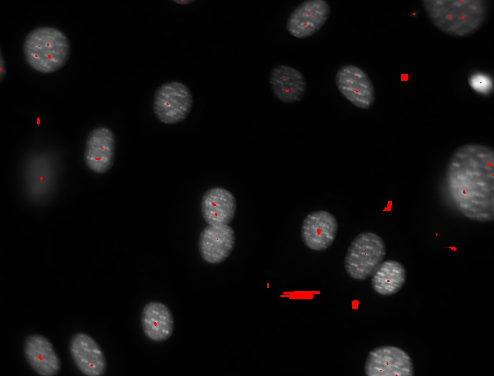
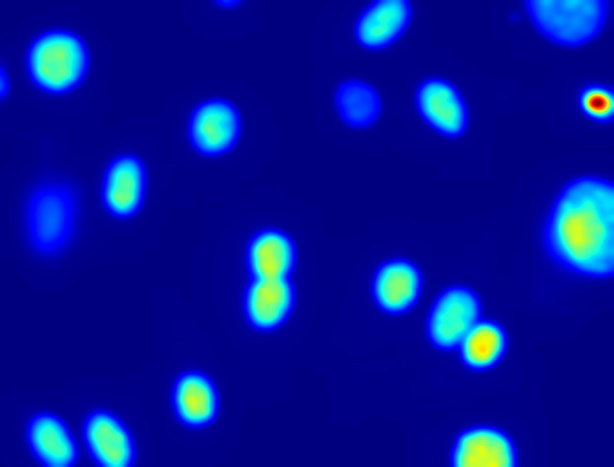
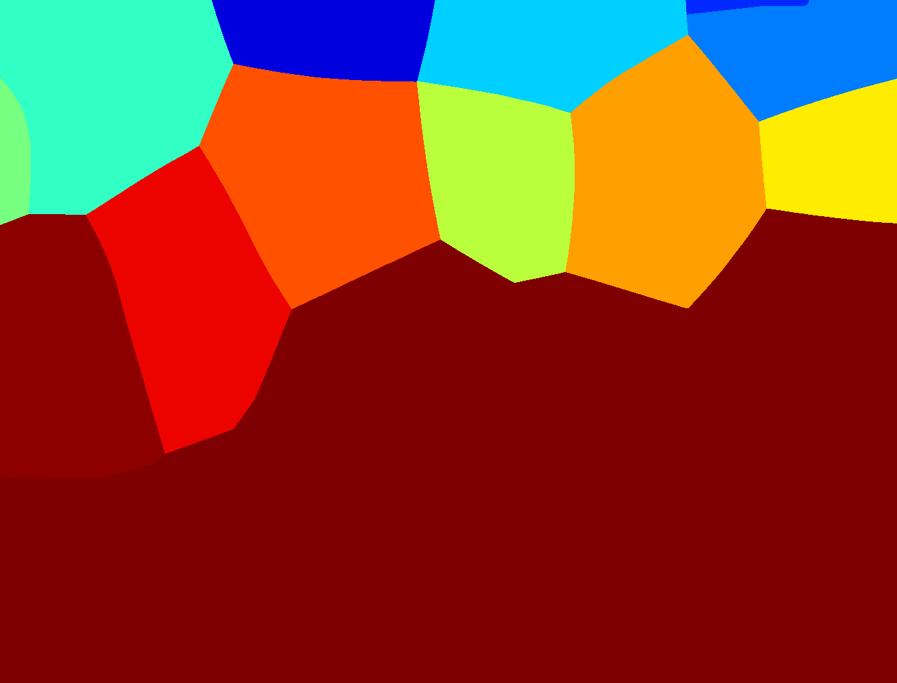
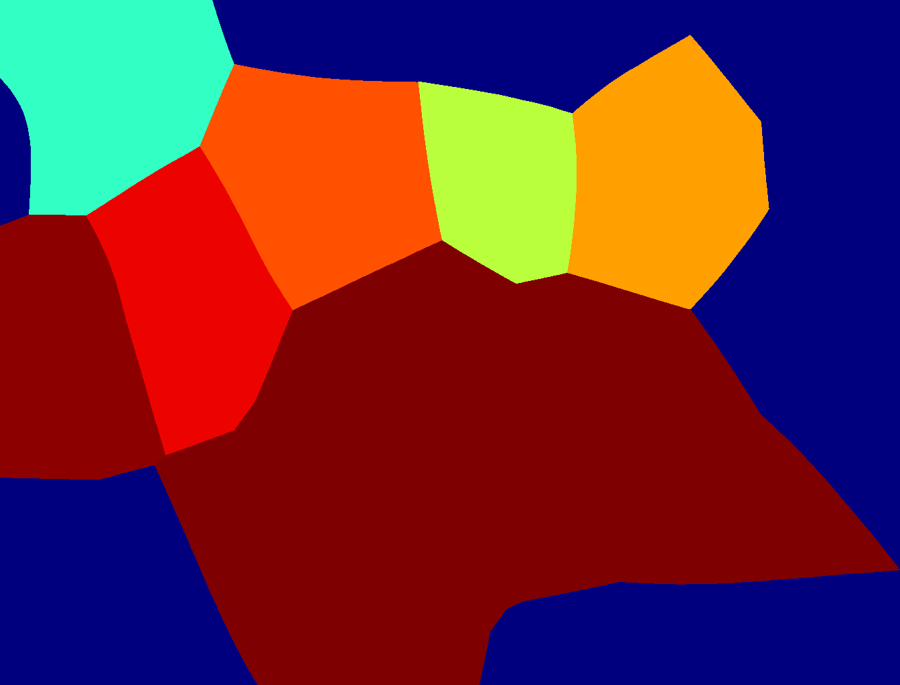

=======================
Python Image Tutorial
=======================

More than a HOWTO, this document is a HOW-DO-I use Python to do my image processing tasks. Image processing means many things to many people, so I will use a couple of examples from my research to illustrate.

Introduction
~~~~~~~~~~~~

Basic Software
---------------

I am going to assuyme that you have installed the following:
    - Python 2.5, 2.6, or 2.7 (avoid 3.0 or 3.1---too new)
    - numpy
    - scipy
    - matplotlib
    - ipython

Under Linux, you can just install your distribution's packages (install at least python-numpy, python-scipy, python-numpy-dev, python-matplotlib, ipython). Under Windows or Mac OS, this is more complicated. Fortunately, some people have done the work for us and built packages that have this. Install either Python xy or the Enthought Python Distribution (actually this works on Linux too, if you prefer this method).

Other Software
--------------

You will need one of the following packages:
    - Python Image Library
    - readmagick

You should also download and install pymorph.

First Task: Counting Nuclei
~~~~~~~~~~~~~~~~~~~~~~~~~~~

Our first task will be to take this image and count the number of nuclei (you can click on the image and download it to try this at home):

.. image:: static/images/dna.jpeg
   :width: 25%
   :align: center
   :target: _static/images/dna.jpeg

Before we start, let us import the needed files. For all code examples in this tutorial, I am going to assume that you typed the following before coming to the example:

.. code-block:: python

    import numpy as np
    import scipy
    import pylab
    import pymorph
    import readmagick
    from scipy import ndimage

These are the packages listed above (except *pylab* is a part of matplotlib).

In Python, there is image processing tools spread across many packages instead of a single package. Fortunately, they all work on the same data representation, the numpy array [#]_. A numpy array is, in our case, either a two dimensional array of integers (height x width) or, for colour images, a three dimensional array (height x width x 3 or height x width x 4, with the last dimension storing (red,green,blue) triplets or (red,green,blue,alpha) if you are considering transparency).

The first step is to get the image from disk into a memory array:

.. code-block:: python

   dna = readmagick.readimg('dna.jpeg')

If you don't have readmagick, you can use:

.. code-block:: python

   dna = scipy.misc.pilutil.imread('dna.jpeg')

Readmagick is not as standard as scipy, but it handles more file types.

Playing Around
~~~~~~~~~~~~~~

In interactive mode (i.e., if you are running this inside *ipython*), you can see the image:

.. code-block:: python

   pylab.imshow(dna)
   pylab.show()

If you set up things in a certain way, you might not need the *pylab.show()* line. For most installations, you can get this by running *ipython -pylab* on the command line [#]_.

You might be surprised that the image does not look at all like the one above. It will probably look like:

This is because, by default, pylab shows images as a heatmap. You can see the more traditional grey-scale image by switching the colormap used:

.. code-block:: python

    pylab.imshow(dna)
    pylab.gray()
    pylab.show()

We can explore our array a bit more:

.. code-block:: python

    print dna.shape
    print dna.dtype
    print dna.max()
    print dna.min()

Since dna is just a numpy array, we have access to all its attributes and methods (see the `numpy documentation`_ for complete information).

.. _`numpy documentation`: http://docs.numpy.org/

The above code prints out:

::

    (1024, 1344)
    uint8
    252
    0

The shape is 1024 pixels high and 1344 pixels across (recall that the convention is the matrix convention: *height x width*). The type is *uint8*, i.e., unsigned 8-bit integer. The maximum value is 252 and the minimum value is 0 [#]_. 

.. code-block:: python

    pylab.imshow(dna // 2)
    pylab.show()

Here, we are displaying an image where all the values have been divided by 2 [#]_. And the displayed image is still the same! In fact, pylab contrast-stretches our images before displaying them.

Some Actual Work
~~~~~~~~~~~~~~~~

Here's the first idea for counting the nuclei. We are going to threshold the image and count the number of objects.

.. code-block:: python

    import pyslic
    T = pyslic.thresholding.otsu(dna)
    pylab.imshow(dna > T)
    pylab.show()

Here, again, we are taking advantage of the fact that dna is a numpy array and using it in logical operations (*dna > T*). The result is a numpy array of booleans, which pylab shows as a black and white image (or red and blue if you have not previously called *pylab.gray()*).

.. image:: static/images/dna-otsu.jpeg
   :width: 25%
   :align: center

This isn't too good. The image contains many small objects. There are a couple of ways to solve this. A simple one is to smooth the image a bit using a Gaussian filter.

.. code-block:: python

   import pyslic
   dnaf = ndimage.gaussian_filter(dna, 8)
   T = pyslic.thresholding.otsu(dnaf)
   pylab.imshow(dnaf > T)
   pylab.show()

The function *ndimage.gaussian_filter* takes an image and the standard deviation of the filter (in pixel units) and returns the filtered image. We are jumping from one package to the next, calling *ndimage* to filter the image, *pyslic* to compute the threshold and *pylab* to display it, but everyone works with *numpy arrays*. The result is much better:

.. image:: static/images/dnaf-otsu.jpeg
   :width: 25%
   :align: center

We now have some merged nuclei (those that are touching), but overall the result looks much better. The final count is only one extra function call away:

.. code-block:: python

   labeled,nr_objects = ndimage.label(dnaf > T)
   print nr_objects
   pylab.imshow(labeled)
   pylab.jet()
   pylab.show()

We now have the number of objects in the image (*18*), and we also displayed the *labeled* image. The call to *pylab.jet()* just resets the colourmap to *jet* if you still had the greyscale map active.

.. image:: static/images/dnaf-otsu-labeled.jpeg
   :width: 25%
   :align: center

We can explore the *labeled* object. It is an integer array of exactly the same size as the image that was given to *ndimage.label()*. It's value is the label of the object at that position, so that values range from 0 (the background) to *nr_objects*.

Second Task: Segmenting the Image
~~~~~~~~~~~~~~~~~~~~~~~~~~~~~~~~~

The previous result was acceptable for a first pass, but there were still nuclei glued together. Let's try to do better.

Here is a simple, traditional, idea:

    # smooth the image
    # find regional maxima
    # Use the regional maxima as seeds for watershed

Finding the seeds
-----------------

Here's our first try:

.. code-block:: python

   dnaf = ndimage.gaussian_filter(dna, 8)
   rmax = pymorph.regmax(dnaf)
   pylab.imshow(pymorph.overlay(dna, rmax))
   pylab.show()

The ``pymorph.overlay()`` returns a colour image with the grey level component being given by its first argument while overlay its second argument. The result doesn't look so good:

If we look at the filtered image, we can see the multiple maxima:

After a little fiddling around, we decide to try the same idea with a bigger sigma value:

.. code-block:: python

   dnaf = ndimage.gaussian_filter(dna, 16)
   rmax = pymorph.regmax(dnaf)
   pylab.imshow(pymorph.overlay(dna, rmax))

Now things look much better.

.. image:: static/images/dnaf-16-rmax-overlay.jpeg
   :width: 25%
   :align: center

We can easily count the number of nuclei now:

.. code-block:: python

   seeds,nr_nuclei = ndimage.label(rmax)
   print nr_nuclei

Which now prints ``22``.

Watershed
---------

We are going to apply watershed to the distance transform of the thresholded image:

.. code-block:: python

   T = pyslic.thresholding.otsu(dnaf)
   dist = ndimage.distance_transform_edt(dnaf > T)
   dist = dist.max() - dist
   dist = ((dist - dist.min())/float(dist.ptp())*255).astype(np.uint8)
   pylab.imshow(dist)
   pylab.show()

.. image:: static/images/dnaf-16-dist.jpeg
   :width: 25%
   :align: center

We can now call ``pymorph.cwatershed`` to get the final result:

.. code-block:: python

   nuclei = pymorph.cwatershed(dist, seeds)
   pylab.imshow(nuclei)
   pylab.show()

.. image:: static/images/nuclei-segmented.png
   :width: 25%
   :align: center

It's easy to extend this segmentation to the whole plane by using generalised Voronoi (i.e., each pixel gets assigned to its nearest nucleus):

.. code-block:: python

   import pyslic
   whole = pyslic.segmentation.gvoronoi(nuclei)
   pylab.imshow(whole)
   pylab.show()

Often, we want to provide a little quality control and remove those cells whose nucleus touches the border. So, let's do that:

.. code-block:: python

   borders = np.zeros(nuclei.shape, np.bool)
   borders[ 0,:] = 1
   borders[-1,:] = 1
   borders[:, 0] = 1
   borders[:,-1] = 1
   at_border = np.unique(nuclei[borders])
   for obj in at_border:
       whole[whole == obj] = 0
   pylab.imshow(whole)
   pylab.show()

This is a bit more advanced, so let's go line by line:

.. code-block:: python

   borders = np.zeros(nuclei.shape, np.bool)

This builds an array of zeros, with the same shape as nuclei and of type ``np.bool``.

.. code-block:: python

   borders[ 0,:] = 1
   borders[-1,:] = 1
   borders[:, 0] = 1
   borders[:,-1] = 1

This sets the borders of that array to ``True`` (``1`` is often synonimous with ``True``).

.. code-block:: python

   at_border = np.unique(nuclei[borders])

``nuclei[borders]`` gets the values that the nuclei array has where ``borders`` is ``True`` (i.e., the value at the borders), then ``np.unique`` returns only the unique values (in our case, it returns ``array([ 0,  1,  2,  3,  4,  6,  8, 13, 20, 21, 22])``).

.. code-block:: python

   for obj in at_border:
       whole[whole == obj] = 0

Now we iterate over the border objects and everywhere that ``whole`` takes that value, we set it to zero [#]_. We now get our final result:

Learn More
~~~~~~~~~~

You can explore the documentation for numpy at `docs.numpy.org`_. You will find documentation for scipy at the same location. For pymorph, you can look at its `original documentation`_.

.. _`docs.numpy.org`: http://docs.numpy.org/
.. _`original documentation`: http://www.mmorph.com/pymorph/

However, Python has a really good online documentation system. You can invoke it with ``help(name)`` or, if you are using *ipython* just by typing a question mark after the name of the function you are interested in. For example, if you want details on the *pymorph.regmax* function:

::

  In [10]: pymorph.regmax?
  Type:           function
  Base Class:     <type 'function'>
  String Form:    <function regmax at 0xa0495a4>
  Namespace:      Interactive
  File:           /usr/local/lib/python2.6/dist-packages/pymorph-0.91-py2.6.egg/pymorph/mmorph.py
  Definition:     pymorph.regmax(f, Bc=None)
  Docstring:
      - Purpose
          Regional Maximum.
      - Synopsis
          y = regmax(f, Bc=None)
      - Input
          f:  Gray-scale (uint8 or uint16) image.
          Bc: Structuring Element Default: None (3x3 elementary cross).
              (connectivity).
      - Output
          y: Binary image.
      - Description
          regmax creates a binary image y by computing the regional
          maxima of f , according to the connectivity defined by the
          structuring element Bc . A regional maximum is a flat zone not
          surrounded by flat zones of higher gray values.

All the projects listed above have very complete documentation. You can also get information on methods of an object by typing, in ``ipython``, something like ``img.ptp?`` where ``img`` is a numpy array to get information on the ``ptp`` function (which returns ``img.max() - img.min()``, by the way).

Footnotes
~~~~~~~~~

.. [#] Strictly speaking, this is not true. There is also the Python Imaging Library (PIL), which is not the same as numpy (in fact, you have to convert back and forth). For the kind of image processing that I will be talking about, this does not matter as PIL is targetted towards other types of image manipulation.

.. [#] This is so useful that, if you are familiar with the shell, you might consider setting up an alias *pylab=ipython -pylab*. The pylab argument also imports several numerical packages (including numpy, which is named np, scipy, and pylab).

.. [#] For the curious, I contrast stretched the image for this tutorial.

.. [#] If you are not too familiar with Python, you might not be confortable with the *dna // 2* notation. While 4 divided by 2 is obviously 2, it is not always clear what 3 divided by 2 should be. The *integer division* answer is that it's 1 (with remainder 1), while the *floating-point division* answer is that it is 1.5. In Python, the *//* operator always gives you the integer division, while */* used to give you integer division and now gives you the floating-point one.

.. [#] In practice this is not the most efficient way to do this. The same operation can be done much faster like this ``for obj in at_border: whole *= (whole != obj)``. Multiplying or adding boolean arrays might seem strange at first, but it's a very useful idiom.

